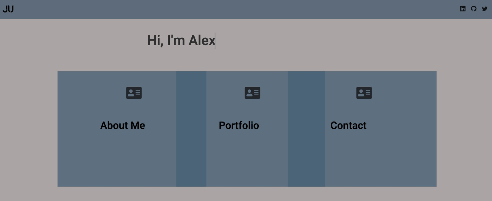

# ¡Second Challenge GeeksHubs!

## Introduction
- This challenge consists of the reproduction of our website
- Using basic concepts in HTML5 CSS and JavaScript
- I add functionality in the form with JavaScript

## Languages and Tools
   

## Functions
- [Carousel animation with CSS CSS, line 20 to 41](css/portfolio.css)

- [Animation with CSS to show my name CSS, line 34](css/index.css)

- [function to redirect from portfolio to a new tab](js/main.js)

- [Function to validate all camps, line 33](js/form.js)

- [Regular expression to make sure the data is entered, line 33](js/form.js)

## Image

# Coding 👨🏽‍💻
| Hours worked | 6 Hours and half |
| -----------  | ---------------  |

## Proyects
- <a href="https://github.com/2020-JAUG">This is a link to my repositories</a>

- [Introduction](#introduction)

    